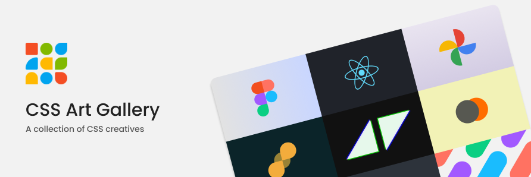

# CSS Art Gallery &middot;  [](LICENSE) [](README.md) [](https://app.netlify.com/sites/css-art-gallery/deploys)


;

Run the `yarn start` command in the terminal

This command will run the app in the development mode.
Open http://localhost:3000 to view it in the browser.

The page will reload if you make edits. You will also see any lint errors in the console.

<br />

## Some rules and suggestions for making the CSS Art.

1. Create your own folder inside the `/art` folder.
2. Folder name should be as follows. YourName + ArtName <br />For example, SalilNaikTeddy,
3. Give [gradient](https://uigradients.com/) or solid background colours to the `.container` class. Kindly do not keep the background white in colour.
4. To test your component, import your component to app.js. DO NOT FORGET to remove the import from App.js before you push. Since multiple contributors are going to contribute at the same time, almost every contributor will get merge conflicts. So, edit app.js file only for test purpose, DO NOT push app.js changes to GitHub.
5. Check out `index.css` for common CSS. DO NOT EDIT THIS FILE.
6. If you are coding an object inside the container, for example, a logo, a geometrical shape or an object, kindly make sure the total dimensions (width and height) do not exceed 150px. You may take up to 180px when it is required. 

### Folder Structure

```
frontend
├── art
│   ├── 1_template (this is the template)
│   │    ├── template.jsx
│   │    └── style.module.css
│   |
│   ├── SalilNaikTeddy
│   │    ├── SalilNaikTeddy.jsx
│   │    └── style.module.css
│   |
│   └── RajCar
│        ├── RajCar.jsx
│        └── style.module.css
│
└──  App.js
```

<br />

## React Component Conventions

1. **Strictly** follow [PascalCase](https://techterms.com/definition/pascalcase) naming convention for naming React Components.
2. Import CSS module file as **style** in all the pages and components. Example, `import style from 'style.module.scss'`
3. Do not edit or remove anything from the template provided. Only add the code where you are told to add.

<br />

## Prerequisits

| &nbsp;                                                                     |
| -------------------------------------------------------------------------- |
| Download [Node JS](https://nodejs.org/en/)                                 |
| Download [Git](https://git-scm.com/)                                       |
| Learn about [CSS Modules](https://css-tricks.com/css-modules-part-1-need/) |
